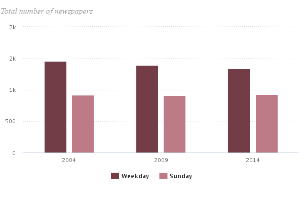
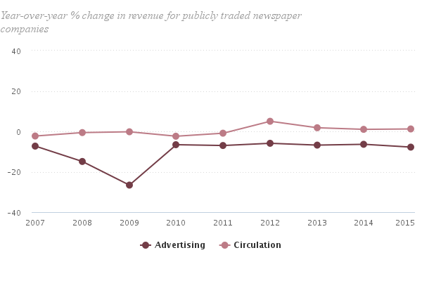
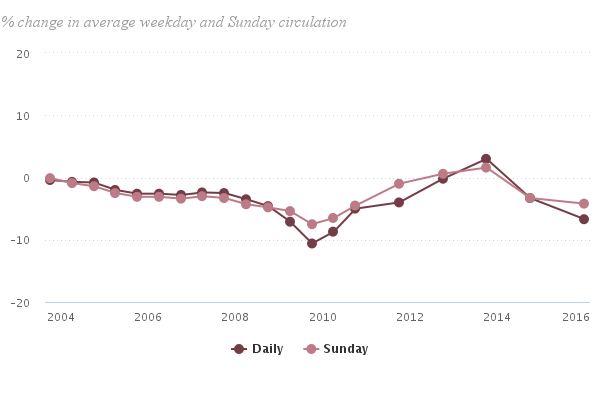

```{r load-packages, message = FALSE}
library(ggplot2)
library(dplyr)
library(statsr)
```

```{r load-data}
load("gss.Rdata")
```


* * *

## Part 1: Data
The data for the General Social Survey (GSS) are collected by researchers at the National Opinion Research Center (NORC) at the University of Chicago. [According to Wikipedia](https://en.wikipedia.org/wiki/General_Social_Survey):

> The survey was conducted every year from 1972 to 1994 (except in 1979, 1981, and 1992). Since 1994, it has been conducted every other year. 

Thus, the survey has collected data for over four decades.

#### How the data is collected

Survey respondents are 18 and over, living in a household in the United States, and are randomly selected from a mix of urban, suburban, and rural areas using [area probability sampling](https://en.wikipedia.org/wiki/Survey_sampling#Probability_sampling), also known as random sampling.

#### Survey methodology

The survey is conducted face-to-face by NORC at the University of Chicago. ([source](https://en.wikipedia.org/wiki/General_Social_Survey#Methodology))

#### Implications for inference

Because the respondents are randomly selected and represent less than ten percent of the population of the United States we have a very good data set for drawing inferences about the general population. Note that we may draw correlations from the data; but because it is not a random experiment **we cannot draw causal conclusions from the data.**

* * *

## Part 2: Research question

For the past few decades the newspaper industry in the United States has seen declines in revenue and circulation. The Pew Research Center tracks revenue and circulation numbers about the newspaper industry and publishes their data online.

The GSS asks the question "How often do you read the newspaper - every day, a few times a week, once a week, less than once a week, or never?"

**Our research question:** If we make inferences to the U.S. population based on the GSS data for news readership, will our results agree with or contradict Pew's results showing declines in newspaper circulation and revenue?``

We might expect the self-reported frequency of newspaper reading done by respondents to show declines as well.

The decline of the newspaper industry has a personal fascination for me since I began my career as a software developer first for the Cleveland Plain Dealer's web site, then the New York Times and later Forbes. I have many colleagues still working in the news business. The struggle of the industry to find profitability in the digital age has a special drama for me.

### A look at Pew Research's public data

[According to Pew Research Center](http://www.journalism.org/2016/06/15/newspapers-fact-sheet/), the total number of daily newspapers has decreased by more than 100 since 2004, from 1,457 down to 1,331:



#### Declining revenues

Pew Research also give us numbers for the revenue declines. Note that every point on this graph that lies below zero represents a decline in revenue over the previous year; for advertising revnue every year has shown a decline, and for circulation revenue growth has largely been flat:



#### Declining circulation

Similarly, Pew reports circulation declines for most years since 2004:



We might expect to see declines in the amounts of time reported spent reading newspapers in the GSS data for the years 2004 and 2012.

* * *

## Part 3: Exploratory data analysis

First let's filter the data set down to just "year," where the year is either 2004 or 2012 (the most recent year in the GSS data). We'll filter out rows where "news" is N/A and omit all other columns except for "year" and "news."

```{r filter-gss}
gssInterestingYears <- filter(gss, year == 2004 | year == 2012)
gssNewsResponded <- filter(gssInterestingYears, !is.na(news))
gssScoped <- gssNewsResponded[c("year","news")] # could have used select() here too, same result
str(gssScoped)
```

Now let's have a look at those values for 2004:

```{r plot-2004}
ggplot(data = filter(gssScoped, year == 2004), aes(x = news)) + geom_bar() + labs(title = "2004") +  xlab("Year 2004 responses: 'How often do you read the newspaper'")
```

Let's do the same for 2012:

```{r plot-2012}
ggplot(data = filter(gssScoped, year == 2012), aes(x = news)) + geom_bar() + labs(title = "2012") + xlab("Year 2012 responses: 'How often do you read the newspaper'")
```

It appears there's a difference in the responses between the two years -- there are significantly more "Never" responses in 2012. Let's compare them side by side:

```{r compare-2004-2012}
gssYearAsFactor <- gssScoped %>% mutate(year = factor(year))
ggplot(data = gssYearAsFactor, aes(x = news)) + geom_bar(aes(fill = year), position = "dodge") + labs(title = "2004 and 2012") + xlab("How often do you read the newspaper?")
```

But we must keep in mind there were different numbers of responses between the two years, so we must take care not to compare apples to oranges. 

```{r show-counts}
ggplot(data = gssYearAsFactor, aes(x = year)) + geom_bar(width=0.25, fill="lightblue") + labs(title = "2004 versus 2012") + xlab("Difference in the number of responses, 2004 and 2012")
```

* * *

## Part 4: Inference

Is "news" independent from "year?" Stated another way, is there a relationship between "year" and "news?" Because the responses for "news" have five distinct values, we can use the Chi-square test of independence to see.

#### Hypotheses test
Our **null hypothesis** is that there is no relationship between "year" and "news." It doesn't matter which year you look at; people's self-reported newspaper reading habits do not vary by year.

Our **alternative hypothesis** is that there *is* a relationship between "year" and "news." People's self-reported newspaper reading habits *do* vary by year.

#### Are the conditions met for the chi-square independence test?

Let's check the conditions:

1. Independence. The sampled observations of the GSS are indeed independent; they are randomly selected, without replacement, and are less than 10% of the population.
2. Sample size: each cell must have at least 5 expected cases:

```{r factors-table}
table(gssYearAsFactor$news, gssYearAsFactor$year)
```

So we meet condition 2 and we are OK to conduct the chi-square test for independence.

#### Why the chi-square test for independence?

We are looking two categorical variables (year, news) and we want to know if the two are dependent. Because "news" can have five levels we use the chi-square test for independence.

#### Performing inference

Using the 'summary' and 'table' functions gives us the chi-square test for independence:

```{r chi-square}
summary(table(gssYearAsFactor$news, gssYearAsFactor$year))
```

We can calculate the p-value the way we were shown in class, too:

```{r chi-square-too}
pchisq(118.33, df = 4, lower.tail = FALSE)
```

The p-value is very small so we can reject the null hypothesis in favor of the alternative hypothesis, that "news" and "year" are associated.

#### Interpreting the results

Can we conclude that the later the year, the fewer the number of people who read the newspaper? No, we cannot! That would imply causality. As stated at the outset we can show correlation between two variables but we cannot infer causation.

But the GSS data is pretty clear: people are reading newspapers less in 2012 than 2004, which correlates with the Pew Research data for the newspaper industry.

#### Caveats

The General Social Survey relies on self-reported numbers. That is, respondents are asked how often they read a newspaper: Every day? Once a week? Never? The survey is relying on the respondent's memory, which may be imperfect. We can hope the researchers at NORC have taken this variation into account in how they conduct the survey.

Age may be another confounding factor in the results here. It is likely younger people read the newspaper less frequently than elderly people.

We also do not know if the respondents discriminate between reading a physical, printed newspaper or the online version.

#### Possible future research

We do not break down newspaper readership by age; it is widely thought that younger people do not read newspapers much, if at all. Does the GSS data correlate to that? One place the GSS data cannot help us is whether newspaper articles arrived at through social media can make up the difference between those who respond they never, or rarely, read a newspaper and those who do. For certain publications like the Washington Post or New York Times their reach is certainly larger than their circulation numbers (due to articles shared via social media) but we don't know how much.